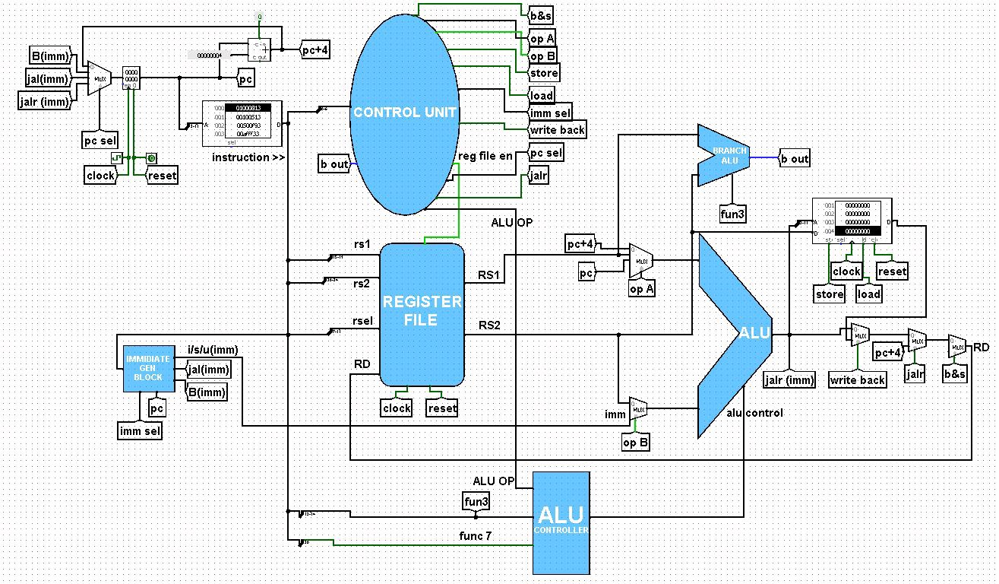

# RV32I MICROPROCESSOR

## Phase 1:
This is a Single Cycle RISCV Processor in which all integer
type commands and operations can be performed
(including jal,jalr,branch commands etc).Both
sequential and control flow operations can be
executed on this microprocessor. I have used RISCV assembly
language instructions to decorde them through opcodes
then the respective signals gets onn and all the
instructions breakdown into pieces including
opcode, immediate ( constant ,if their any ),
alu operation ,registers etc.All this is done on
logisim software. This microprocessor
includes the following blocks:
- immediate generation block
- opcode decoder
- register file
- ALU
- Branch ALU
- ALU controller
And many multiplexers and memories from the top file veiw.



## Phase 2:
After implementing on a drag and drop software called
logisim. It is then coded in a hardware discriptive language
called SYSTEMVERILOG.In further upgradation a bus architechture
(SOC) called TILELINK is also implemented in this single cycle
processor which provides communication between memories and core.
For which 2 channel A are used for request signals
and 2 channel D are used for response signals from core to
memories (host to device) and viseversa.
After interconnecting whole processor it is tested on verilator
using fusesoc.

## To RUN the core
To run the core :
1) Clone the repo.
4) Run the following :
   ```
   cd RV32I-Microprocessor
   ```
   ```
   fusesoc --cores-root=. run --target=sim top --vcd
   ```
5) To see wave form output on gtk-wave :
   `cd build/top_1.0/sim-verilator`
6) Open the `trace.vcd` file to see waveform

## Sample Tests
link of riscv assembly codes and their hexa values. (tested codes)
https://docs.google.com/spreadsheets/d/14NU7tBv-i7zpZHIYiMBVQ3DX
mnE4UchTyx7spAzkmaI/edit#gid=1593725999
