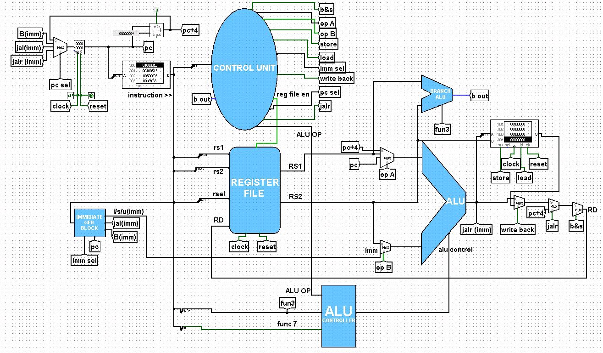

# RV32I MICROPROCESSOR

## DESIGN

### Phase 1:
A RV32I RISC-V processor was developed to execute the RV32I integer instruction
set, including arithmetic/logical operations, loads and stores, JAL/JALR, and
conditional branches. The instruction word is decoded into its opcode,
register fields, immediate values, ALU operation, and control signals. The
initial design was structured around the basic processor datapath and control
blocks required to execute the instruction stream.

The processor included the following main blocks:
- immediate generation block
- opcode / instruction decoder
- register file
- ALU
- Branch ALU
- ALU controller
- multiplexers
- instruction and data memories

The early datapath was used as the foundation for the later microarchitectural
expansions.



### Phase 2:
The processor datapath was described in SystemVerilog and integrated with a
lightweight SoC memory interface based on **TileLink Uncached Lightweight
(TL-UL)**. TL-UL provides a Channel A request path and a Channel D response
path between a host and a device. The core acts as the host, while the
instruction and data memories act as devices.

The SoC-level interface therefore contains:
- one Channel A / Channel D pair for instruction-memory communication
- one Channel A / Channel D pair for data-memory communication

The interface carries the request/response information needed by the current
RTL, including valid/ready, opcode, address, data, size, and mask signals.

The SystemVerilog implementation was exercised using simulation and RTL
analysis tools as part of the processor development flow.

### Phase 3:
The architecture was extended from a simple sequential datapath into a
**2-wide RV32I Out-of-Order (OoO) core** while keeping the design focused on
resource-efficient execution rather than adding unnecessary speculative
hardware.

The current microarchitecture uses a 2-wide frontend and dynamic scheduling
with the following main structures:
- 2-wide fetch, decode, rename, and dispatch
- Register Alias Table (RAT)
- free-list based physical-register allocation
- 60-entry physical register file
- 28-entry reorder buffer (ROB)
- 12-entry unified reservation-station / issue-queue
- 14-entry store queue
- 6-entry branch/JALR checkpoint buffer
- 2 ALU-capable execution resources
- EXU1 shared between ALU and branch/JALR resolution
- one shared AGU/LSU port for loads and stores
- 2-slot writeback
- 2-wide in-order commit

The resulting execution model is genuinely out-of-order: instructions are
dispatched into the ROB and reservation stations, wait for their operands to
become ready, and can issue independently of program order. The ROB preserves
program order for retirement.

The main execution flow is:

```text
Fetch → Decode → Rename → Dispatch
                    ↓
               ROB + RS + SQ
                    ↓
            Wakeup / Oldest-Ready Select
                    ↓
          ALU / Branch / Load / Store
                    ↓
                 Writeback
                    ↓
             In-Order Commit
```

### Phase 4:
The OoO core was further refined with explicit mechanisms for the interactions
that become important in a 2-wide dynamically scheduled processor.

The current design includes:
- physical-register renaming to remove WAR/WAW hazards
- PRF ready bits and same-cycle writeback bypass for RAW dependencies
- reservation-station wakeup and oldest-ready issue selection
- deterministic execution-port arbitration
- store-queue based memory ordering
- byte-range load/store overlap checking
- exact-range store-to-load forwarding where supported
- checkpoint-based branch recovery
- parallel squash of younger speculative state
- precise in-order retirement
- deterministic handling of 2-wide same-cycle corner cases
- recovery-time cancellation of in-flight loads and speculative writeback

The branch policy is intentionally **static not-taken**. No BTB/BHT or dynamic
branch predictor is included in the current design; this keeps predictor state
and fetch-stage prediction timing out of the critical frontend while accepting
the corresponding branch-performance cost.

Recovery restores speculative rename state in one cycle and then resumes
through the normal frontend refill path. Stores modify architectural memory
only at commit.

### Phase 5:
The current RTL is organized so that the major microarchitectural structures
map directly to SystemVerilog state and modules. The principal ownership model
is:
- **RAT / free list:** architectural-to-physical mapping and physical-tag allocation
- **PRF:** physical values and readiness
- **ROB:** program order, completion, retirement, and recovery metadata
- **Reservation stations:** operand state, wakeup, and issue selection
- **Store queue:** in-flight store address/data and load/store ordering
- **Checkpoint buffer:** speculative rename-state recovery
- **Writeback network:** result broadcast to PRF, RS, ROB, and dispatch bypass
- **Commit / recovery:** architectural retirement and speculative-state removal

The design is intentionally kept minimal. Features such as dynamic branch
prediction, multiple LSU ports, memory-dependence prediction, wider issue,
and a larger scheduling window are treated as future scalability upgrades
rather than part of the current implementation.

## SIMULATION

1) Clone the repo.

2) Enter the simulation directory:
```bash
cd Simulation
```

### To run SystemVerilog simulation

The current design is organized as a SystemVerilog OoO core. Use the project
simulation target or the simulator flow provided by the repository.

For Verilator/FuseSoC-based simulation, if the repository target is configured:

3)
```bash
fusesoc --cores-root=. run --target=sim RV32I --vcd --timeout 1000000
```

4) To inspect a generated waveform with GTKWave:
```bash
cd build/top_1.0/sim-verilator
gtkwave trace.vcd
```

### To run verification / formal flows

If the repository contains the corresponding verification targets, use the
provided Makefile or FuseSoC target for the selected simulator.

For Questa:
```bash
make sim
```

For a GUI-based Questa run:
```bash
make simgui
```

For JasperGold:
```bash
jg jaspergold.tcl
```

The exact simulation/verification target names should match the checked-in
repository configuration.

## MEMORY INTERFACE

The processor uses a lightweight TileLink Uncached Lightweight (TL-UL)
style host/device interface.

### Channel A — Request

Channel A carries requests from the core (host) toward a memory device and
contains the request information used by the RTL, including:
- valid / ready
- opcode
- address
- data
- size
- mask

### Channel D — Response

Channel D carries responses from the memory device back to the core and
contains:
- valid / ready
- opcode
- size
- data

Instruction memory and data memory use independent request/response channel
pairs in the SoC-level interface.

## SAMPLE TESTS

The repository can contain RV32I assembly programs under the simulation/test
directories. A typical flow is:

1. Write or select an RV32I assembly test.
2. Assemble/convert it to the memory format expected by the RTL.
3. Place the resulting instruction image where the configured instruction
   memory expects it.
4. Run the selected simulation target.
5. Inspect waveforms and architectural behavior as needed.

The exact test and memory-file commands should follow the repository's current
simulation scripts and checked-in configuration.

## CURRENT ARCHITECTURE AT A GLANCE

| Resource | Current design |
|---|---|
| ISA | RV32I |
| Frontend width | 2-wide |
| Issue width | 2 |
| Writeback | 2-slot |
| Commit | 2-wide, in order |
| Physical registers | 60 |
| ROB | 28 entries |
| Reservation stations / IQ | 12 entries |
| Store queue | 14 entries |
| Checkpoints | 6 |
| Execution resources | EXU0 ALU, EXU1 ALU+Branch/JALR, shared AGU/LSU |
| Branch policy | Static not-taken |
| Recovery | Checkpoint-based parallel squash |
